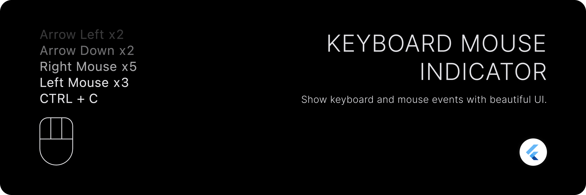

# Keyboard Mouse Indicator

A beautiful widget that shows mouse and keyboard events.

## Features

- Global listeners for mouse and keyboard events that do not rely on focus.
- Show events as a history of key combinations.
- Customizable count for history items visible.
- Show current keys pressed. (minimal keyboard indicator)
- Fully customizable mouse indicator.
- Customizable keyboard history items.
- Displays counts for each individual and composed events.

## Getting started

Add the package to your `pubspec.yaml` file:

```yaml
dependencies:
  keyboard_mouse_indicator: <latest_version>
```

## Usage

Use the `KeyboardMouseIndicator` widget to show the indicator.

```dart
KeyboardMouseIndicator(
  controller: controller,
  alignment: Alignment.bottomLeft,
  showAsHistory: true,
);
```

| Property | Description                                                                                                                  |
| --- |------------------------------------------------------------------------------------------------------------------------------|
| `controller` | The controller to control the indicator.                                                                                     |
| `alignment` | The alignment of the indicator. This affect the alignment of the history item text too.                                      |
| `showAsHistory` | Whether to show events as a history or current keys pressed. Currently pressed keys are displayed if this is set to `false`. |
| `mouseIndicator` | The widget to show for mouse indicator.                                                                                      |
| `maxLength` | The maximum length of history to show.                                                                                       |
| `fadeText` | Whether to fade the text of history items to have disappearing effect.                                                       |
| `itemSpacing` | The spacing between history items.                                                                                           |
| `showMouseIndicator` | Whether to show mouse indicator.                                                                                             |
| `keyLabelBuilder` | The builder to build the key label string.                                                                                   |
| `itemBuilder` | The builder to build the history item widget.                                                                                |


This will show keyboard and mouse events as a history with maximum of 5 events.

## Customization

### Showing more history.

By default, the widget shows only 5 events as a history. You can change this by setting `maxLength` property.

```dart
KeyboardMouseIndicator(
  alignment: Alignment.bottomLeft,
  showAsHistory: true,
  maxLength: 10, // Show recent 10 events
);
```

### Showing current keys pressed.

By default, the widget shows events as a history. You can change this by setting `showAsHistory` property to `false`.
It will show current keys pressed.

```dart
KeyboardMouseIndicator(
  alignment: Alignment.bottomLeft,
  showAsHistory: false,
);
```

### Manually clearing history/keys pressed.

You can clear the history/keys pressed by calling `clear` method on `KeyboardMouseController`.

1. Pass `KeyboardMouseController` to `KeyboardMouseIndicator` widget.

```dart

final controller = KeyboardMouseController();

KeyboardMouseIndicator(
  controller: controller,
  alignment: Alignment.bottomLeft,
  showAsHistory: true,
);
```

2. Call `clear` method on `KeyboardMouseController` to clear history/keys pressed.

```dart
controller.clear();
```

### Customizing mouse indicator widget.

You can customize the mouse indicator widget by passing `mouseIndicator` property to `KeyboardMouseIndicator` widget.

```dart
KeyboardMouseIndicator(
  controller: controller,
  alignment: Alignment.bottomLeft,
  showAsHistory: true,
  mouseIndicator: MouseIndicator(
    height: 72,
  ),
);
```

### Styling mouse indicator widget

You can style the mouse indicator widget by passing `style` property to `MouseIndicator` widget. `MouseIndicatorStyle`
has two types: `MouseIndicatorStyle.filled` and `MouseIndicatorStyle.outlined`.
By default, it is `MouseIndicatorStyle.outlined`.

```dart
KeyboardMouseIndicator(
  controller: controller,
  alignment: Alignment.bottomLeft,
  showAsHistory: true,
  mouseIndicator: MouseIndicator(
    height: 72,
    style: MouseIndicatorStyle.outlined(
      borderColor: Colors.white,
      indicatorColor: Colors.white,
      backgroundColor: Colors.transparent,
      borderWidth: 4,
      showScrollButton: true,
      scrollButtonWidth: 48,
      buttonsHeightFactor: 0.5,
      borderRadius: BorderRadius.circular(8),
    ),
  ),
);
```

| Property | Description |
| --- | --- |
| `borderColor` | The color of border of the mouse indicator. Defaults to `ColorScheme.onSurface`. |
| `indicatorColor` | The color of indicator of the mouse indicator. Defaults to `borderColor`. |
| `backgroundColor` | The color of background of the mouse indicator. |
| `borderWidth` | The width of border of the mouse indicator. |
| `showScrollButton` | A boolean value that indicates whether to show scroll button or not. |
| `scrollButtonWidth` | The width of scroll button. It is used to adjust the width of scroll button. `scrollButtonWidthFactor` can be used in place of this to provide width in terms of percentage. |
| `buttonsHeightFactor` | The height percentage of mouse buttons. It is used to adjust the height of mouse buttons. |
| `scrollButtonWidthFactor` | The width percentage of scroll button. Scroll button width can be provided in terms of percentage of available width for a single button as if all 3 buttons are of same width. This can be used in place of `scrollButtonWidth`. |
| `border` | Allows to provide custom border for the mouse indicator. Any `OutlinedBorder` can be used here. If this is provided, `borderColor`, `borderWidth` and `borderRadius` must not be provided. |

For more details, please refer to the documentation of `MouseIndicatorStyle`.

Similarly, you can use `MouseIndicatorStyle.filled` to style the mouse indicator widget.

```dart
KeyboardMouseIndicator(
  controller: controller,
  alignment: Alignment.bottomLeft,
  showAsHistory: true,
  mouseIndicator: MouseIndicator(
    height: 72,
    style: MouseIndicatorStyle.filled(
      indicatorColor: Colors.white,
      backgroundColor: Colors.transparent,
      showScrollButton: true,
      scrollButtonWidth: 48,
      buttonsHeightFactor: 0.5,
      spacing: 12,
    ),
  ),
);
```

| Property | Description |
| --- | --- |
| `indicatorColor` | The color of indicator of the mouse indicator. Defaults to `ColorScheme.onSurface`. |
| `backgroundColor` | The color of background of the mouse indicator. |
| `showScrollButton` | A boolean value that indicates whether to show scroll button or not. |
| `scrollButtonWidth` | The width of scroll button. It is used to adjust the width of scroll button. `scrollButtonWidthFactor` can be used in place of this to provide width in terms of percentage. |
| `buttonsHeightFactor` | The height percentage of mouse buttons. It is used to adjust the height of mouse buttons. |
| `scrollButtonWidthFactor` | The width percentage of scroll button. Scroll button width can be provided in terms of percentage of available width for a single button as if all 3 buttons are of same width. This can be used in place of `scrollButtonWidth`. |
| `spacing` | The spacing between mouse buttons. |

### Custom items UI for history.

You can customize the UI of history items by passing `itemBuilder` property to `KeyboardMouseIndicator` widget.

```dart
KeyboardMouseIndicator(
  controller: controller,
  alignment: Alignment.bottomLeft,
  showAsHistory: true,
  itemBuilder: (int index, KeyIndicatorEvent item) {
    // return your custom widget here
  },
);
```

`KeyIndicatorEvent` describes the event. It has following properties:

| Property | Description |
| --- | --- |
| `mouseButton` | The mouse button that was pressed. |
| `keyboardKey` | The keyboard key that was pressed. This excludes modifier keys. |
| `modifierKey` | List modifier keys that was pressed. This includes CTRL, ALT, SHIFT, META, OPTION etc. |
| `count` | The number of times the key/combination was pressed. |

### Custom key labels.

You can customize the key labels by passing `keyLabelBuilder` property to `KeyboardMouseIndicator` widget.

```dart
KeyboardMouseIndicator(
  controller: controller,
  alignment: Alignment.bottomLeft,
  showAsHistory: true,
  keyLabelBuilder: (LogicalKeyboardKey key) => key.debugName,
);
```

## Contribution

You are most welcome to contribute to this project!

Please have a look
at [Contributing Guidelines](https://github.com/BirjuVachhani/keyboard_mouse_indicator/blob/main/CONTRIBUTING.md), before
contributing and proposing a change.

#### Liked this package?

Show some love and support by starring the repository.

Or You can

<a href="https://www.buymeacoffee.com/birjuvachhani" target="_blank"></a>

## License

```
Copyright © 2023 Birju Vachhani

Licensed under the Apache License, Version 2.0 (the "License");
you may not use this file except in compliance with the License.
You may obtain a copy of the License at

    http://www.apache.org/licenses/LICENSE-2.0

Unless required by applicable law or agreed to in writing, software
distributed under the License is distributed on an "AS IS" BASIS,
WITHOUT WARRANTIES OR CONDITIONS OF ANY KIND, either express or implied.
See the License for the specific language governing permissions and
limitations under the License.
```